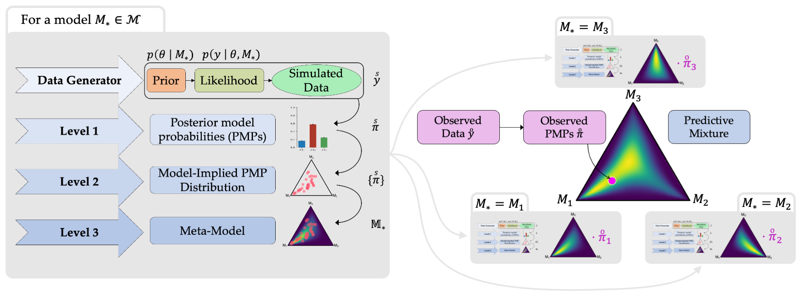

<!-- README.md is generated from README.Rmd. Please edit that file -->

Meta-Uncertainty represents a fully probabilistic framework for quantifying the uncertainty over Bayesian posterior model probabilities (PMPs) using meta-models. Meta-models integrate simulated and observed data into a predictive distribution for new PMPs and help reduce overconfidence and estimate the PMPs in future replication studies. 

# Meta-Uncertainty Framework

<!-- badges: start -->
<!-- badges: end -->

This repository contains the accompanying code for the preprint
*Meta-Uncertainty in Bayesian Model Comparison*:
<https://arxiv.org/abs/2210.07278>

In order to reduce both the computational and setup effort for replicating the experiments, we include `RData` objects and checkpoints for the evidential neural networks.

Note that the `R` code is structured as a package, thus requiring a local installation with subsequent loading via `library(MetaUncertaintyPaper)`.
